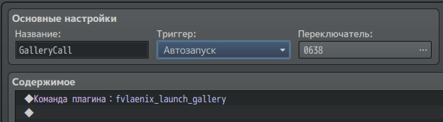
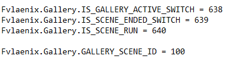

# Gallery for RPG MV games

## Warning

**If you are editing someone else's game, make sure that the author of that game does not mind that you are making modifications. Of course, I have little control over such things, but try not to do such things**

Of course, I don't mind at all if you post this on my F95 forum, where there is already some audience, and your gallery will be a little more popular

## Introduction

The gallery is a collection of scenes that can be viewed without changing the state of the game in any way. This feature is present in many games, but, alas, is present as a direct repetition of the code that is used in the event. This seems wrong to me, and brings with it a large number of problems. My version carries a lot of pluses:

1. I only refer to events without repeating their code, and if an event has been changed, I don't have to repeat it several times
2. The gallery structure is convenient and has a much more welcoming "API" than a bunch of different branches in the game itself
3. All variables, all switches will be reset, and you won't have to switch them back manually when you return from the scene
4. The gallery is much easier to install

## How it works

Any event that can happen in the game (be it a map event, a general event, or an event in the troop events menu) is a regular list of commands that can be copied, can be changed, and so on. My gallery has the ability to take this list and execute it. Of course, you can modify this list, add new things to it, and so on


## Warning

Since the gallery was developed gradually, often in a hurry, often the author made such large gaps that he forgot he already had similar features and duplicated them, some of the code may seem unnecessary, and in general obnoxious. You are warned

## Preparing to develop a gallery

You have to have the game itself, of course. It must have a project file .rpgproject

If you do not have such a file, it is likely that your game is encrypted. Look for decryptors on the Internet (e.g. [this](https://bitbucket.org/SilicaAndPina/rpgmv-decryptor)).

Next you need the [RPG Maker VX editor](https://www.rpgmakerweb.com/products/rpg-maker-mv). It is the one that will help you find all the events you want to see. Make sure your game opens with this editor, make sure it runs.

## Reconnaissance

Open the game with RPG Maker VX and find an event that we want to repeat. Unfortunately, there is no secret ingredient here. You have a bunch of maps, and the event of interest is probably on the map where it happened. Perhaps it is also in the common events (Tools -> Database -> Common Events)

Carefully remember your events, how to activate them. Most likely you will accumulate a list.

## First Steps to the Gallery

The gallery is quite easy to install. 

In order to install it:

1. You need to copy the gallery directory contents into the folder www/js/plugins (or js/plugins).

2. Select the one switche that will be responsible for the gallery. You just need to know the Id switche that are not used by the game. You can just use big id's. Go to Common Events and add a new event for the gallery there.



(There is another language so it must be any name, trigger: autorun, and plugin command `fvlaenix_launch_gallery`)

5. Finally, go to Fvlaenix_Gallery.json and find the variables you want to change there. This file can be opened with notepad. The first one switches should be exactly the same as the last one switche, the others is obsolete, but it better be unused too, and the fourth should be a free variable



6. Go to the plugins settings and add plugins in the right order


7. Start the game and we should see a gallery in the menu. If we go to this menu, we will see the item "Rose". If we go into it, we get an error. This is the normal state

## Structure of gallery

The gallery itself is a tree-like structure. That is, there is a main root MAIN_GALLERY, which will open when you click on the Gallery button. Just think of it like the files and folders on your computer. This is the very tree you will need to build.

Let's introduce the concept of Node and Scene. Node is a folder that contains other folders and scenes, and Scene is a specific list of commands, that is, the scene itself

All changes can be made in the Impl.rb file. You can edit it with Notepad. It already has the Rose folder that we declared.

```
const rose = new Fvlaenix.Gallery.Node("Rose", "TODO")

Fvlaenix.Gallery.MAIN_GALLERY.add_node(rose)
```

This is how a new folder is added. Every time you want to do this, you must follow the structure:

```
const <name_of_variable> = new Fvlaenix.Gallery.Node("<name_of_folder>", <description>)

Fvlaenix.Gallery.MAIN_GALLERY.add_node(<name_of_variable>)
```

Of course, we can also add the folder to Rose

```
const karen_scenes_rose = Fvlaenix.Gallery.Node.new("Karen Scenes", "TODO")

rose.add_node(karen_scenes_rose)
```

It is these that will form the tree structure.

Now let's learn how to add scenes. There are two types of scenes: combat and non-combat. Combat scenes cause some kind of battle, and only then perform actions. It looks more natural, but they are more demanding. Let's start with the usual scenes

```
katrina.add_scene(
    new Fvlaenix.Scenes.MapEventScene(
        "katrina_torture",
        "Torture Event",
        "TODO",
        new Fvlaenix.PlayerPosition(13, 9, 10, 2),
        new Fvlaenix.Callables.MapEventById(13, 4, 1)
    )
)
```

The scene is added to the Node using the add_scene function.

The scene itself is created using the MapEventScene class, which takes 5 arguments in the constructor: scene id, scene name, scene description, coordinates of the player where he will be teleported to, and finally the event itself.
* Id - just some unique string. Not actually used yet, but planned to be used.
* Name - The name that will be displayed in the gallery.
* Description - the text that will be displayed in the gallery on the side
* Player position - a class that contains map_id, x, y, direction (8 - up, 4 - left, 6 - right, 2 - down).
* And finally the callable. It will be discussed in more detail

### Callables

Quite an extensive class of possible classes.

Any one of them can be framed in the scene.

Let's analyse them all:

+ `Fvlaenix.Callables.MapEventById.new(<map_id>, <event_id>, <page_id>)` - means the event that happened on the map with id = <map_id>, with the event with id = <event_id>, and on the page <page_id>
+ `Fvlaenix.Callables.MapEventByName.new(<map_id>, <event_name>, <page_id>)` - means the same thing, but now instead of the event id the name
+ `Fvlaenix.Callables.CommonEvent.new(<event_id>)` - means the common event with id = <event_id>
+ `Fvlaenix.Callables::VariableChange.new(<id>, <value>), Fvlaenix.Callables.SwitchChange(<id>, <value>)` - Switches events on the map and global

There are several other options. Try adding a scene, and if it plays, add the rest

## Examples

There are several sample galleries in the repository